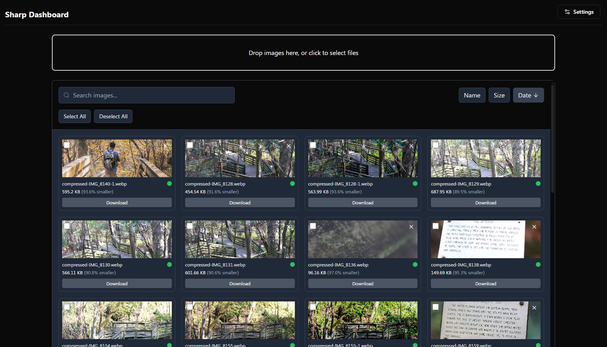

# Sharp Dashboard

Your pipeline for compressing & resizing images, sorted! Sharp is a web application for compressing and managing images with customizable compression settings.

The server uses [sharp](https://github.com/lovell/sharp) for image processing.

## Features

- Image upload and gallery view
- Customizable compression settings
- Real-time image compression
- Before/After image comparison
- Ability to re-adjust compression settings
- Bulk upload, re-adjust, and download

## Screenshots

### Dashboard


### Compression Settings


### Before/After Comparison


## Prerequisites

Before you begin, ensure you have installed:
- Node.js (v18 or higher)
- npm (Node Package Manager)

## Installation

1. Clone the repository:
git clone https://github.com/surajk95/sharp-dashboard.git

2. Install dependencies:
```
# Install root dependencies
npm install:all
```

## Development

To run the application in development mode:

```
# Start the server & client (from the root directory)
npm run dev
```

The application will be available at `http://localhost:3001`

You can also run the client & server separately:

```
# Start the client (from the client directory)
npm run dev:client

# Start the server (from the server directory)
npm run dev:server
```

## Project Structure

```
├── client/
│   ├── app/
│   │   ├── components/
│   │   │   └── dashboard/
│   │   ├── types/
│   │   └── page.tsx
│   ├── package.json
│   └── ...
├── server/
│   ├── server.js
│   ├── package.json
│   └── ...
├── package.json
```

## Scripts
Please check package.json for more scripts.

## Contributing

1. Fork the repository
2. Create your feature branch (`git checkout -b feature/amazing-feature`)
3. Commit your changes (`git commit -m 'Add some amazing feature'`)
4. Push to the branch (`git push origin feature/amazing-feature`)
5. Open a Pull Request

## Support

For support, please open an issue in the repository.